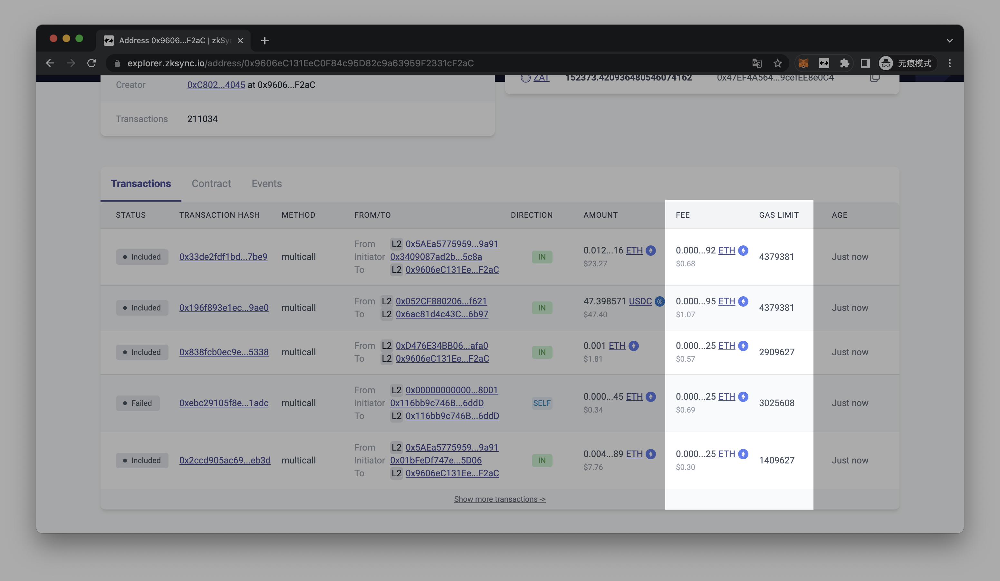

🚀 zkSync Explorer Boost

  

> Display **Fee** and **Gas Limit** in the transactions table of the zkSync Era explorer.

## Usage

1. Navigate to the [Releases](https://github.com/holazz/zks-explorer-boost/releases) section, download the latest version of the extension, and unzip it.

2. Open `chrome://extensions/` and Enable **Developer Mode**.

3. Click **Load Unpacked** and select the folder you just unzipped.

## License

[MIT](./LICENSE) License © 2023 [zz](https://github.com/holazz)
